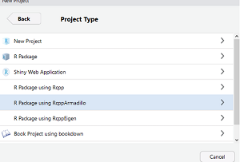

# Yet Another RStudio Application

It all starts with a story... Below is the live tale behind the code in this repository.

## Getting ready

First some enthusiasism in our first commit.


I have a few ideas!

* I love the *bootstrap* technique;  I used to teach computational statistics at ITAM, and now I'm a PhD student at UT Austin with interest statistical methods for complex data. I want to do something simple but elegant and illustrative:
* Let's follow Davidson and Hinkley and design a function for (parametric) bootstrap robust simple linear regression (beginning of ch. 6).
* I will use `Rcpp` for speed. In fact, I'll use `RcppArmadillo` because it's very easy to implement.
* Let's make this a package! It should be easy with `devtools` and `roxygen2`.
* Everything should work smoothly under the `tidyverse` workflow.
* I will visualize the results with `ggplot2`! There is nothing as great as ggplot out there, every other library becomes tedious when it comes to plotting real data (especially the Python ones...).
* I love unit testing and coverage. I definitely need to include this in my package and link to travis.
* Creating branches in my git workflow is kind of boring when you are the only user.. but let's do this the good way. I will add features progressively.
* This is yet another application, so let's do this snappy.
* Oh, by the way, this README is an `rmarkdown`.

## Creating the package



If you want to install this package and test it in your computer just run

```r
devtools::install_github('mauriciogtec/YetAnotherRStudioApplication')
```

## Configuring continuous integration with Travis and `covr`

To make sure all releases work just fine (especially since Rcpp needs to be built). I will include the file .travis.yml and register this repository. Below are the banners provided. 

---
[](https://travis-ci.org/mauriciogtec/YetAnotherRStudioApplication)
[](https://codecov.io/gh/mauriciogtec/YetAnotherRStudioApplication)
---