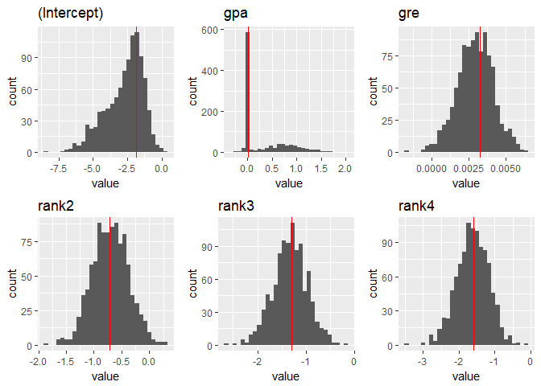

# Yet Another RStudio Application

It all starts with a story... Below is the live tale behind the code in this repository.

## Getting ready

First some enthusiasism in our first commit.


I have a few ideas, I hope you like them!

* I love the *bootstrap* technique;  I used to teach computational statistics at ITAM, and now I'm a PhD student at UT Austin with interest statistical methods for complex data. I want to do something simple but elegant and illustrative:
* Let's follow Davidson and Hinkley and design a function for (parametric) bootstrap robust simple linear regression (beginning of ch. 6).
* I will use `Rcpp` for speed. In fact, I'll use `RcppArmadillo` because it's very easy to implement.
* Let's make this a package! It should be easy with `devtools` and `roxygen2`. I discovered unit testing not long ago, but ever since my life is different; for this, I will use `testthat`.

More ideas:

* Everything should work smoothly within the `tidyverse` workflow.
* I will visualize the results with `ggplot2`! There is nothing as great as ggplot out there, every other library becomes tedious when it comes to plotting statistical data (especially the Python ones...).
* Creating git branches is kind of boring when you are the only user.. but let's do this anyway. I will add features progressively and keep track using continuous integration with `Travis CI` and `Codecov`.
* Oh, by the way, this README is an `rmarkdown`.

Let's get started!

## Continuous integration and unit testing


If you want to install this package and test it in your computer just run

```r
devtools::install_github('mauriciogtec/YetAnotherRStudioApplication')
```

*Note*: All docuemntation will be created with roxygen directives and the function `devtools::document()`. 

## Configuration of Travis CI and Codecov with `covr` and testthat.

To make sure all releases work just fine (especially since Rcpp needs to be built). I will register the repository in Travis CI and Codecov. I am excited, `travis_integration` and `tests` will be the frist branches. And...

Great news! Our first merge! From now on I won't talk about git branches We'll just believe I'll continue working the right way. 


Here are my precious banners:

---

[](https://travis-ci.org/mauriciogtec/YetAnotherRStudioApplication)
[](https://codecov.io/gh/mauriciogtec/YetAnotherRStudioApplication)

---


##  A light bootstrap library


```r
library(YetAnotherRStudioApplication)
library(tidyverse)
library(ggplot2)
library(gridExtra)
```


The light-weight library comprises three basic R functions
- *constructor*: creates a bootstrap resample by sampling only the indices
- *indexing*: defines a bracket notation to simplify indexing
- *mapping*: applies a function to each resample. It is using the power of `purrr` (with some code piracy) and it is already somewhat powerful


```r
#' @title light bootstrap constructor
#' @description creates resampling indices but does not make entire copies of the dataset
#' @param d a data.frame, tibble or matrix 
#' @export
bootstrap <- function(data, times = 50L) {
  # Validate input
  !inherits(data, c("data.frame", "matrix")) && stop("d must be a data frame or numeric matrix")
  # Create samples for the most basic bootstrap scheme
  idx <- replicate(times, sample(nrow(data), replace = TRUE), simplify = FALSE)
  names(idx) <- paste0("sample", 1:times)
  # Output boot_light object
  # new("bootstrap_light", data = data, indices = idx, times = as.integer(times))
  x <- list(data = data, idx = idx, times = as.integer(times))
  class(x) <- c("bootstrap")
  x
}

#' @title boot light indexing
#' @description simplifies accessing a bootstrap resample
#' @details use `x[i]` to access the i-th resample
#' @rdname bootstrap
#' @export
`[.bootstrap` <- function(x, i) x$data[x$idx[[i]], ]


#' @title Apply a function to each entrie of bootstrap
#' @description creates resampling indices but does not make entire copies of the dataset
#' @param x a bootstrap_light object
#' @param .f function to apply to x, can be formula, see the map in the purrr package for details
#' @export
bootstrap_map <- function(x, .f, times = 50L) {
  # Validate input
  !inherits(x, c("bootstrap")) && stop("x must be of class bootstrap")
  !inherits(.f, c("function")) && stop("FUN must be a function")
  # Create samples for the most basic bootstrap scheme
  .f <- purrr:::as_mapper(.f)
  purrr::map(1:x$times, function(i) .f(x[i]))
}
```

Our example data looks like this

```r
data <- read_csv("https://stats.idre.ucla.edu/stat/data/binary.csv") %>% 
  mutate(admit = factor(admit)) %>% 
  mutate(rank = factor(rank))
head(data)
```

```
## # A tibble: 6 x 4
##    admit   gre   gpa   rank
##   <fctr> <int> <dbl> <fctr>
## 1      0   380  3.61      3
## 2      1   660  3.67      3
## 3      1   800  4.00      1
## 4      1   640  3.19      4
## 5      0   520  2.93      4
## 6      1   760  3.00      2
```

We'll be interested in predicting admittance into a UCLA program using a logistic regression with bootstrap. The following scatter diagram shows that there seems to be an association between higher GREs and acceptance. The effect of the GPA is less clear (ggplot makes it easy to compare by fixing the axis limits).


```r
ggplot(data, aes(x = gre, y = gpa)) +
  geom_point() +
  facet_grid(admit ~ rank, labeller = labeller(rank = function(i) paste0("rank", i)))
```

<!-- -->
Now what I'm gonna do is *mess badly with my data* by introducing an outlier. We want to see how the bootstrap will be stand superior to the simple model.

```r
data$gpa[1] <- 40.0
```


Of course we want to use bootstrap, but let us quickly first show the results of a logistic regression (measured in terms of prediction).


```r
mod <- glm(admit ~ ., data = data, family = "binomial")
original_coeffs <- coefficients(mod)
summary(mod)
```

```
## 
## Call:
## glm(formula = admit ~ ., family = "binomial", data = data)
## 
## Deviance Residuals: 
##     Min       1Q   Median       3Q      Max  
## -1.5230  -0.8723  -0.6593   1.1781   2.1118  
## 
## Coefficients:
##              Estimate Std. Error z value Pr(>|z|)    
## (Intercept) -1.848906   0.711978  -2.597 0.009408 ** 
## gre          0.003222   0.001019   3.163 0.001562 ** 
## gpa          0.013772   0.066646   0.207 0.836291    
## rank2       -0.720677   0.313127  -2.302 0.021361 *  
## rank3       -1.294947   0.341410  -3.793 0.000149 ***
## rank4       -1.600576   0.415043  -3.856 0.000115 ***
## ---
## Signif. codes:  0 '***' 0.001 '**' 0.01 '*' 0.05 '.' 0.1 ' ' 1
## 
## (Dispersion parameter for binomial family taken to be 1)
## 
##     Null deviance: 499.98  on 399  degrees of freedom
## Residual deviance: 464.49  on 394  degrees of freedom
## AIC: 476.49
## 
## Number of Fisher Scoring iterations: 4
```

Prediction accuracy

```r
pred <- round(fitted.values(mod, data))
sprintf("Original model accuracy is %0.2f%%", 100*sum(pred == data$admit) / nrow(data))
```

```
## [1] "Original model accuracy is 69.50%"
```

We'll now show an example of crude bootstrap regression prediction with our  (later we see a parametric bootstrap more efficient version). 


```r
set.seed(999)
system.time({
  b_data <- bootstrap(data, times = 500L)
})
```

```
##    user  system elapsed 
##       0       0       0
```
Evidently, the new object doesn't grow in size proportionally to the number of resamples, since only a row indices are being created. For 500 resamples, the growth factor in this dataset is


```r
as.numeric(object.size(b_data) / object.size(data))
```

```
## [1] 85.32913
```

We now want to obtain to apply the regression to each bootstrap sample (here we are using `purrr`'s formula approach to defining functions)

```r
system.time({
  b_models <- bootstrap_map(b_data, ~glm(admit ~ ., data = .x, family = "binomial"))
})
```

```
##    user  system elapsed 
##    2.35    0.02    2.38
```
 
Let's start by comparing the coefficients of the model. We can use `purrr::map` and `purrr::reduce` to collect the bootstraps.


```r
b_coefs <- b_models %>% 
  map(~coefficients(.x)) %>% 
  reduce(rbind) 
```


```r
b_coefs %>% 
  apply(2, mean)
```

```
## (Intercept)         gre         gpa       rank2       rank3       rank4 
## -2.63094444  0.00299234  0.28086952 -0.70274370 -1.32650436 -1.63605475
```

The following plot shows the value of the coefficients for each bootstrap resample, and in red the original estimate.


```r
plots <- b_coefs %>% 
  as.data.frame() %>% 
  gather("coef", "value") %>% 
  split(.$coef) %>% 
  map(~ ggplot(., aes(x = value)) +
    geom_histogram(bins = 30) +
    geom_vline(xintercept = original_coeffs[.$coef[1]], colour = "red") +
    facet_grid(coef ~ .) +
    ggtitle(.$coef[1])) 
marrangeGrob(plots, 3, 2)
```

<!-- -->

We can obtained improved model estimates and standard errors, comparing the original estimates (note: the original estimates given by the summary are in fact an approximation based on the model assumptions--the bootstrap version is not)

Mean values

```r
b_coefs %>% 
  apply(2, mean)
```

```
## (Intercept)         gre         gpa       rank2       rank3       rank4 
## -2.63094444  0.00299234  0.28086952 -0.70274370 -1.32650436 -1.63605475
```
Standard deviation

```r
b_coefs %>% 
  apply(2, sd)
```

```
## (Intercept)         gre         gpa       rank2       rank3       rank4 
## 1.336811050 0.001231083 0.445644529 0.320265131 0.347078333 0.428003035
```

If we compare with the original estimates for the mean and standard deviation of the coefficient, they were completely different. 

Let's now compare predictions. We'll bootstrap the predictions for each individual, and the take a final decision by averaging every model separately.


```r
b_pred <- b_models %>% 
  map(~ predict(., data, type = "response")) %>% 
  reduce(rbind) %>% 
  apply(2, mean) %>% 
  map_dbl(round)
b_acc <- sum(b_pred == data$admit) / nrow(data)
sprintf("The new prediction is %0.2f%%", 100*b_acc)
```

```
## [1] "The new prediction is 70.25%"
```

It's not the best improvement because both models weren't very good in the first place. But it was an improvement. With more complicated models there should be a bigger diference.


