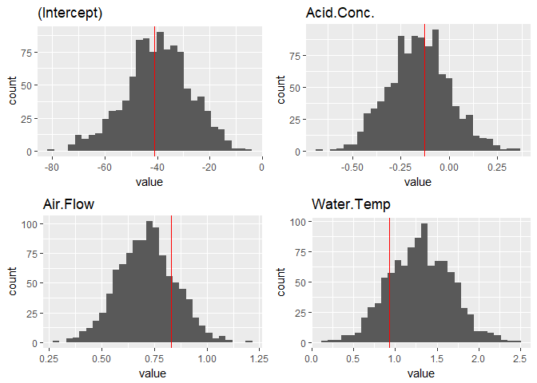

## YARA: Yet another RStudio (internship) application

--------------


-----

***It all starts with a story...***  My love story with R began during college as I learned from my mentor and friend, Ernesto Barrios. Besides being a Probability Professor at my university, he was an advocate of R who spent his energy promoting the use of R in Mexico. With him, I participated in local conferences endorsing R and embraced it as a companion throughout my academic life. I should have RStudio running on my computer at least 350 days a year! 

RStudio is making R great and unique for Data Science, while maintaining its unique flavor and philosophy: friendly to the academic and functional way of thinking. I would really like to take the next step and start contributing to this amazing language, while learning from the best.

I prepared this special repository instead of a cover letter; I hope you like it. I'm using mostly the tools you guys developed at RStudio.

-----

## Index

1. [Ideas][A few ideas for this repository...]
2. [Travis CI, unit testing, and Codecov][Setting-up Travis CI, unit testing, and Codecov]
3. [A light library for bootstrapping][A light library for bootstrapping]
4. [Case study: UCLA admittance][A case study: UCLA admittance]
5. [Robust bootstrap regression with Rcpp][Bootstrapping residuals: robust regression with Rcpp]
6. [Case study: stackloss][Case study: stackloss]
7. [Test files][Test files]

-----


## A few ideas for this repository...


* As a statistician, I love *bootstraping*. I gained some experience when I lectured a course in Computational Statistics at ITAM, and now as PhD student at UT Austin. 
* We'll develop a light general-purpose bootstrapping framework to illustrate the concept of bootstrapping and power of the `tidyverse` tools.
* We'll also do a model-based Bootstrap regression with `RcppArmadillo`. I will more less follow the ideas in Davidson and Hinkley (ch. 6), as suggested in the internship description.
* Let's make this a package using `devtools`! 
* Now serious developing without unit testing! Let's use `testthat`.
* I'll work with Github following the rules of version control, as much as my understanding allows me. Also, I will set-up continuous integration with Travis CI and coverage with Codevov. 
* We'll use other `tidyverse` functions such as readr`, `dplyr`, `tidy` and `purrr`.
* Of course, we'll use `ggplot2` to visualize our results.
* This entire README is being written with `rmarkdown`: no post-processing.

If you want to run the examples I shown in this README, you can install the package with:

```r
devtools::install_github('mauriciogtec/YetAnotherRStudioApplication')
```

Let's get started!

[Back to index][Index]

### Setting-up Travis CI, unit testing, and Codecov

Creating the `.travis.yml` will be define my first branch: exciting. You can check my branches to get an idea of the steps I followed to build this repository... There's also a branch I used to integrate `testthat` and `covr`. I know.. I shouldn't mention git branches anymore... 

My precious:

---

[](https://travis-ci.org/mauriciogtec/YetAnotherRStudioApplication)
[](https://codecov.io/gh/mauriciogtec/YetAnotherRStudioApplication)

---


[Back to index][Index]

###  A light library for bootstrapping

I don't pretend to do anything as powerful as `rsample`. In fact, I wanna show my elementary approach to bootstrapping with a very simple example. Thanks to the `tidyverse` machinery we can hove something up and running in no time.

I'll use the following libraries


```r
library(YetAnotherRStudioApplication) # this package
library(tidyverse)
library(ggplot2)
library(gridExtra)
```


The light-weight example library will have three basic R functions that complete the following tasks

- *construction*: creates the resamples by creating an object that stores the original data and a list of indexes
- *indexing*: defines a bracket notation that simplifies accesing resamples
- *mapping*: bootstrap is all about applying functions to each resample. We will exploit the power of `purrr` 

  *Note*: The documentation is generated using roxygen directives and `devtools::document()`

This function are defined in the file `R/bootstrap.R`. I include them here for story-telling purposes.


```r
#' @title light bootstrap constructor
#' @description creates resampling indices but does not make entire copies of the dataset
#' @param d a data.frame or matrix 
#' @export
bootstrap <- function(data, times = 50L) {
  # Validate input
  !inherits(data, c("data.frame", "matrix")) && stop("d must be a data frame or numeric matrix")
  
  # Create samples for the most basic bootstrap scheme
  idx <- replicate(times, sample(nrow(data), replace = TRUE), simplify = FALSE)
  
  # Output boot_light object
  # new("bootstrap_light", data = data, indices = idx, times = as.integer(times))
  x <- list(data = data, idx = idx, times = as.integer(times))
  class(x) <- c("bootstrap")
  x
}

#' @title boot light indexing
#' @description simplifies accessing a bootstrap resample
#' @details use `x[i]` to access the i-th resample
#' @rdname bootstrap
#' @export
`[.bootstrap` <- function(x, i) x$data[x$idx[[i]], ]


#' @title Apply a function to each entrie of bootstrap
#' @description creates resampling indices but does not make entire copies of the dataset
#' @param x a bootstrap_light object
#' @param .f function to apply to x, can be formula, see the map in the purrr package for details
#' @export
bootstrap_map <- function(x, .f, times = 50L) {
  # Validate input
  !inherits(x, c("bootstrap")) && stop("x must be of class bootstrap")
  !inherits(.f, c("function", "formula")) && stop(".f must be a function or formula")
  
  # Create samples for the most basic bootstrap scheme
  .f <- purrr:::as_mapper(.f) # code piracy, but magical
  purrr::map(1:x$times, function(i) .f(x[i]))
}
```

[Back to index][Index]

### A case study: UCLA admittance

Our task is to predict the admittance of a student into a UCLA program, based on their application features. We will use a logistic regression. We'll be crude in the sense that we will resample each case and run a new regression each time. In the next section there is a perhaps more efficient method, but model-based instead of non-parametric. To make this more interesting, I will alter introduce a noisy outlier in the data later.


```r
data <- read_csv("https://stats.idre.ucla.edu/stat/data/binary.csv") %>% 
  mutate(admit = factor(admit)) %>% 
  mutate(rank = factor(rank))
head(data)
```

```
## # A tibble: 6 x 4
##    admit   gre   gpa   rank
##   <fctr> <int> <dbl> <fctr>
## 1      0   380  3.61      3
## 2      1   660  3.67      3
## 3      1   800  4.00      1
## 4      1   640  3.19      4
## 5      0   520  2.93      4
## 6      1   760  3.00      2
```

The following scatter diagram shows that there seems to be an association between higher `gre` and acceptance. The effect of the `gpa` is less clear to me (we notice how `ggplot2` makes it easy to compare by fixing the plotting limits accross subplots: it is great!).


```r
ggplot(data, aes(x = gre, y = gpa)) +
  geom_point() +
  facet_grid(admit ~ rank, labeller = labeller(rank = function(i) paste0("rank", i)))
```

<!-- -->

Now what I'm gonna do is ***cheat and introduce an outlier***. We want to see how the bootstrap will be stand resistant but the simple model won't.


```r
data$gpa[1] <- 40.0
```

Let's first check what the direct model obtains.


```r
mod <- glm(admit ~ ., data = data, family = "binomial")
original_coeffs <- coefficients(mod)
original_summary <- summary(mod)
original_coeffs
```

```
##  (Intercept)          gre          gpa        rank2        rank3 
## -1.848905784  0.003222303  0.013771710 -0.720677098 -1.294947112 
##        rank4 
## -1.600576455
```

We can test the prediction accuracy


```r
pred <- round(fitted.values(mod, data))
sprintf("Original model accuracy is %0.2f%%", 100*sum(pred == data$admit) / nrow(data))
```

```
## [1] "Original model accuracy is 69.50%"
```

***Let's now create bootstrap samples!***


```r
set.seed(999)
times <- 1000L
system.time({
  b_resamples <- bootstrap(data, times)
})
```

```
##    user  system elapsed 
##    0.03    0.00    0.03
```

Evidently, the new object doesn't grow in size proportionally to the number of resamples, since only indices are being stored. For our 1000 resamples, the growth factor in size for the bootsrapped dataset is


```r
as.numeric(object.size(b_resamples) / object.size(data))
```

```
## [1] 163.274
```

We now run a regression model for each resample:


```r
system.time({
b_models <- bootstrap_map(b_resamples, 
  ~glm(admit ~ ., data = .x, family = "binomial")
)
})
```

```
##    user  system elapsed 
##    4.39    0.06    4.45
```
 
Super fast, at least for this toy example. Let's now comparr the coefficients of the single model and the bootstrapped one. We can use `purrr::map` and `purrr::reduce` to collect the bootstraps estimates.


```r
b_coefs <- b_models %>% 
  map(~coefficients(.x)) %>% 
  reduce(rbind) 
```


```r
b_coefs %>% 
  colMeans()
```

```
##  (Intercept)          gre          gpa        rank2        rank3 
## -2.707795980  0.002936329  0.312005616 -0.703583790 -1.322967905 
##        rank4 
## -1.616685610
```

The following plot shows the value of the coefficients for each bootstrap resample; the red vertical lines are the original estimates.


```r
plots <- b_coefs %>% 
  as.data.frame() %>% 
  gather("coef", "value") %>% 
  split(.$coef) %>% 
  map(~ ggplot(., aes(x = value)) +
    geom_histogram(bins = 30) +
    geom_vline(xintercept = original_coeffs[.$coef[1]], colour = "red") +
    ggtitle(.$coef[1])) 
marrangeGrob(plots, 3, 2, top = NULL)
```

<!-- -->

We can obtained improved model estimates and standard errors:


```r
new_coef <- b_coefs %>% 
  colMeans()
new_sd <- b_coefs %>% 
  apply(2, sd)
```


```r
data_frame(
  `Original coefs` = original_coeffs,
  `bootstrap coefs` = new_coef,
  `Original sd` = original_summary$coefficients[ ,2],
  `Bootstrap sd` = new_sd
)
```

```
## # A tibble: 6 x 4
##   `Original coefs` `bootstrap coefs` `Original sd` `Bootstrap sd`
##              <dbl>             <dbl>         <dbl>          <dbl>
## 1     -1.848905784      -2.707795980   0.711977670    1.363015529
## 2      0.003222303       0.002936329   0.001018785    0.001205232
## 3      0.013771710       0.312005616   0.066645870    0.455348135
## 4     -0.720677098      -0.703583790   0.313126742    0.327269346
## 5     -1.294947112      -1.322967905   0.341410321    0.352229592
## 6     -1.600576455      -1.616685610   0.415043455    0.444447026
```

What we expected happened! The sneaky new outlier messed the original coefficient of `gpa`. In fact, it gave a very bad estimate of its actual standard error. The bootstrapped did a very good job here. I leave it to you to check that bootstraps estimates are actually pretty close to ones we would have had without the outlier.

Let's now compare predictions by selecting the fitted value for each individual in each bootstrapped model. 


```r
b_pred <- b_models %>% 
  map(~ predict(., data, type = "response")) %>% 
  reduce(rbind) %>% 
  colMeans() %>% 
  map_dbl(round)
b_acc <- sum(b_pred == data$admit) / nrow(data)
sprintf("The new prediction is %0.2f%%", 100*b_acc)
```

```
## [1] "The new prediction is 70.50%"
```

We see a modest but positive improvement over the original model.

[Back to index][Index]

## Bootstrapping residuals: robust regression with Rcpp

To finish with the cherry in top of the cake. I want to show an approach for bootstrapping regression by resampling from the errors. This time I will create a single `rcpp` function to do the entire job (just for convenience). There are is, of course, a big room for improvement, yet it is super fast, functional and illustrates the idea.

This code is automaticcaly compiled when installing the package and it's included in the file `src/bootstrap.cpp`:


```cpp
#define ARMA_64BIT_WORD 1
#include <RcppArmadillo.h>
// [[Rcpp::depends(RcppArmadillo)]]
// [[Rcpp::plugins(cpp11)]]

using namespace Rcpp;
using namespace arma;
using namespace std;

//' @title parametric bootstrap regression
//' @export
// [[Rcpp::export]]
Rcpp::List bootstrap_rlm(
      arma::mat &X,
      arma::vec &y,
      int times
    ){
  uword n = X.n_rows;
  uword p = X.n_cols;
  uword B = times;
  
  // Step 1: Obtain the projection matrix and leverages
  mat pseudo_inv = pinv(X);
  mat proj_mat = X * pseudo_inv;
  vec leverage = proj_mat.diag();
  
  // Step 2: Find coefficients and residuals
  vec coeffs = pseudo_inv * y;
  vec fitted = X * coeffs;
  vec err = y - fitted;
  
  // Step 3: Modified residuals
  vec rres = err / sqrt(1 - leverage);
  vec centered_rres = rres - mean(rres);
  
  // Step 4: Resample obtained bootstrapped coefficients
  mat b_coefs(B, p);
  vec b_se(B);
  for (uword i = 0; i < B; i++) {
    // Sample indices
    uvec idx(n); 
    for (uword i = 0; i < n; i++) {
      idx(i) = rand() % n;  // main area of opportunity for improvement
    }
    vec y_i = fitted + centered_rres.elem(idx);
    // Fit regression
    vec coefs_i =  pseudo_inv * y_i;
    b_coefs.row(i) =  coefs_i.t();
    vec err_i = y_i - X * coefs_i;
    b_se(i) = sqrt(sum(square(err_i)) / (n - p)) ;
  }

  return Rcpp::List::create(Named("coefficients") = wrap(b_coefs),
                            Named("se") = wrap(b_se),
                            Named("residuals") = wrap(err),
                            Named("leverages") = wrap(leverage),
                            Named("modified residuals") = wrap(rres));
}
```


[Back to index][Index]

### Case study: stackloss

The `stackloss` dataset is used in the `MASS` documentation to show their robust linear regression model. Without going into much detail of the data, we will compare their `rlm` function with ours.


```r
library(MASS)
```

Our goal is to predict the variable `stack.loss` using regression:


```r
data("stackloss")
X <- stackloss %>% 
  dplyr::select(-stack.loss) %>% 
  cbind(1, .) %>% 
  data.matrix()
y <- stackloss %>% 
  pull(stack.loss)
head(stackloss)
```

```
##   Air.Flow Water.Temp Acid.Conc. stack.loss
## 1       80         27         89         42
## 2       80         27         88         37
## 3       75         25         90         37
## 4       62         24         87         28
## 5       62         22         87         18
## 6       62         23         87         18
```

Here's the `rlm` function from `MASS` as reference


```r
mod <- rlm(stack.loss ~ ., data = stackloss)
summary(mod)
```

```
## 
## Call: rlm(formula = stack.loss ~ ., data = stackloss)
## Residuals:
##      Min       1Q   Median       3Q      Max 
## -8.91753 -1.73127  0.06187  1.54306  6.50163 
## 
## Coefficients:
##             Value    Std. Error t value 
## (Intercept) -41.0265   9.8073    -4.1832
## Air.Flow      0.8294   0.1112     7.4597
## Water.Temp    0.9261   0.3034     3.0524
## Acid.Conc.   -0.1278   0.1289    -0.9922
## 
## Residual standard error: 2.441 on 17 degrees of freedom
```

Now we apply our fast model-based bootstrap function


```r
n_bootstraps <- 1000L
system.time({
bmod <- bootstrap_rlm(X, y, n_bootstraps)
})
```

```
##    user  system elapsed 
##       0       0       0
```

We take a look at our bootstrapped coefficients:


```r
b_coefs <- bmod$coefficient %>% 
  as.data.frame()
names(b_coefs) <- names(mod$coefficients)
head(b_coefs)
```

```
##   (Intercept)  Air.Flow Water.Temp  Acid.Conc.
## 1   -39.99730 0.8247604  1.4404729 -0.28103618
## 2   -28.14672 0.6227701  2.0578232 -0.39736530
## 3   -20.95254 0.8987623  1.0829062 -0.44187797
## 4   -45.20598 0.7734870  0.8250585 -0.02500840
## 5   -39.39274 0.7037804  1.2961675 -0.14372254
## 6   -47.12738 0.6495056  1.4774469 -0.08120211
```

Let's now compare results. We show a histogram of our resamples and the `rlm`'s estimates with red lines.


```r
plots <- b_coefs %>% 
  as.data.frame() %>% 
  gather("coef", "value") %>% 
  split(.$coef) %>% 
  map(~ ggplot(., aes(x = value)) +
    geom_histogram(bins = 30) +
    geom_vline(xintercept = mod$coefficients[.$coef[1]], colour = "red") +
    ggtitle(.$coef[1])) 
marrangeGrob(plots, 2, 2, top = NULL)
```

<!-- -->


```r
b_estimates <- b_coefs %>%
  colMeans()
b_sd <- b_coefs %>% 
  apply(2, sd)
data_frame(
  `MASS rlm coefs` = mod$coefficients,
  `bootstrap coefs` = b_estimates,
  `MASS rlm sd.` = summary(mod)$coefficients[ ,2],
  `bootstrap sd` = b_sd
)
```

```
## # A tibble: 4 x 4
##   `MASS rlm coefs` `bootstrap coefs` `MASS rlm sd.` `bootstrap sd`
##              <dbl>             <dbl>          <dbl>          <dbl>
## 1      -41.0265311       -40.1647615      9.8073472     12.2524227
## 2        0.8293739         0.7175581      0.1111803      0.1378854
## 3        0.9261082         1.2841564      0.3034081      0.3695472
## 4       -0.1278492        -0.1479626      0.1288526      0.1553305
```

The results are indeed pretty similar! We get somewhat wider standard errors, but in the same order of magnitude. 

[Back to index][Index]

### Test files

The tests are included in the folder `tests/testhat/`. They are quite silly, but illustrate the testing framework.


```r
test_that("bootstrap", {
  bset <- bootstrap(iris, 100)
  expect_is(bset, "bootstrap")
  expect_is(bootstrap_map(bset, nrow), "list")
})

test_that("rlm", {
  X <- matrix(c(1,1,1, 4, 3, 1), nrow = 3)
  y <- c(5.5, 3.5, 1.2)
  mod <- bootstrap_rlm(X, y, 100)
  expect_is(mod, "list")
  expect_equal(names(mod), c("coefficients", "se", "residuals", "leverages", "modified residuals"))
})
```


[Back to index][Index]
